# School District Analysis

## Overview

The purpose of this analysis was to calculate and examine various performance metrics for 15 schools in a district. This is a very practical analysis, as the super intendent of a school district must ensure that all schools under their purview are meeting standards in terms of student performance. Additionally, it was discovered that the 9th grade scores at Thomas High School may be corrupted by academic dishonesty. These tainted scores were removed from the data and the analysis was performed on the clean data to see what effect the Thomas High School 9th grade scores had on the entire dataset.

## Results and Discussion

### Results

Images of DataFrames are shown below. "Clean Data" refers to the data after the 9th grade scores from Thomas High School were removed.

**Figure 1. District Summary - Original Data**

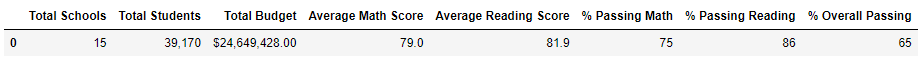

**Figure 2. District Summary - Clean Data**

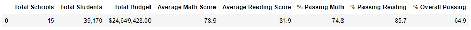

**Figure 3. School Summary - Original Data**

**Figure 4. School Summary - Clean Data**

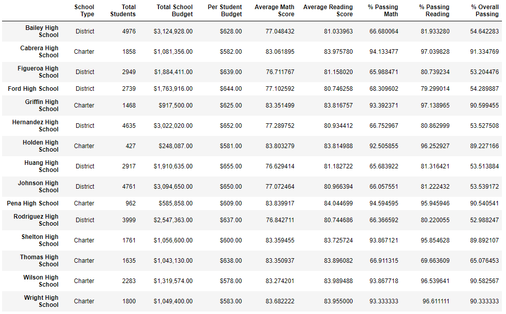

**Figure 5. Math Scores by Grade - Original Data**$$\t\t$$**Figure 6. Math Scores by Grade - Clean Data**

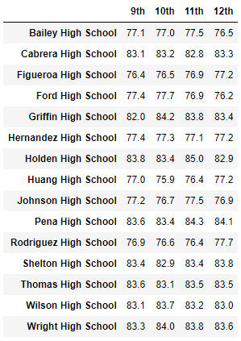$$\t\t\t$$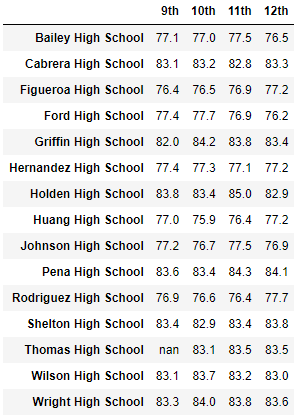

**Figure 6. Math Scores by Grade - Clean Data**

**Figure 7. Reading Scores by Grade - Original Data**

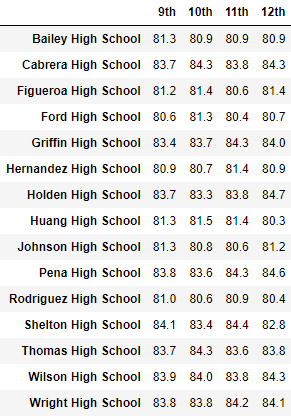

**Figure 8. Reading Scores by Grade - Clean Data**

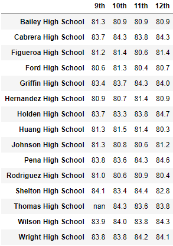

**Figure 9. Scores by School Spending - Original Data**

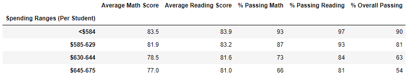

**Figure 10. Scores by School Spending - Clean Data**

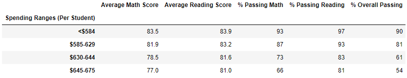

**Figure 11. Scores by School Size - Original Data**

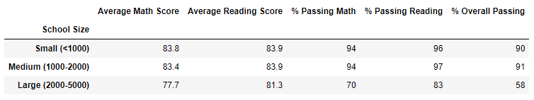

**Figure 12. Scores by School Size - Clean Data**

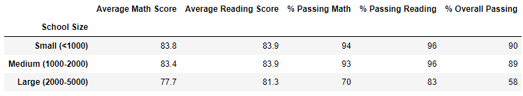

**Figure 13. Scores by School Type - Original Data**

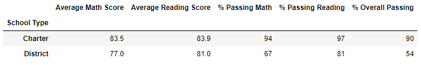

**Figure 14. Scores by School Type - Clean Data**

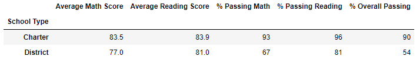
