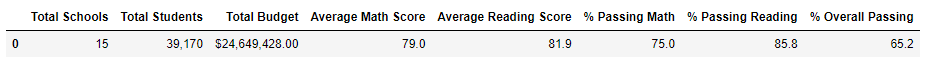
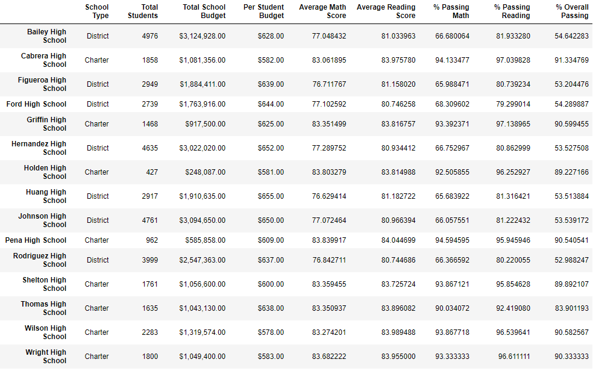
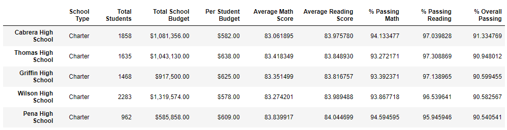
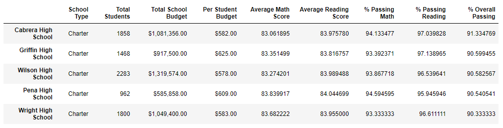

# School District Analysis

## Overview

The purpose of this analysis was to calculate and examine various performance metrics for 15 schools in a district. This is a very practical analysis, as the super intendent of a school district must ensure that all schools under their purview are meeting standards in terms of student performance. Additionally, it was discovered that the 9th grade scores at Thomas High School may be corrupted by academic dishonesty. These tainted scores were removed from the data and the analysis was performed on the clean data to see what effect the Thomas High School 9th grade scores had on the entire dataset.

## Results and Discussion

### Results

Images of DataFrames are shown below. "Clean Data" refers to the data after the 9th grade scores from Thomas High School were removed.

**Figure 1. District Summary - Original Data**

**Figure 2. District Summary - Clean Data**

**Figure 3. School Summary - Original Data**

**Figure 4. School Summary - Clean Data**

**Figure 5. Math Scores by Grade - Original Data**

**Figure 6. Math Scores by Grade - Clean Data**

**Figure 7. Reading Scores by Grade - Original Data**

**Figure 8. Reading Scores by Grade - Clean Data**

**Figure 9. Scores by School Spending - Original Data**

**Figure 10. Scores by School Spending - Clean Data**

**Figure 11. Scores by School Size - Original Data**

**Figure 12. Scores by School Size - Clean Data**

**Figure 13. Scores by School Type - Original Data**

**Figure 14. Scores by School Type - Clean Data**

**Figure 15. Top 5 Schools by % Overall Passing - Original Data**

**Figure 16. Top 5 Schools by % Overall Passing - Clean Data**

### Discussion

* As seen in Figures 1 and 2, the average math score slightly dropped after the Thomas High School 9th grade students were removed, thereby lowering the percentage of students passing math. While the average reading score appears to have stayed the same, the slight drop in percent passing reading implies that at least one removed student had originally passed math. The static average reading score is likely due to rounding. Overall, a smaller proportion of students had passing grades after the data was cleaned.
* Figures 3 and 4 show the difference in the summary by school. The only school of note is Thomas High School, which expectedly shows a drop in the percentage of students passing both reading and math. Interestingly, the average reading score increased after the dishonest scores were removed. This says that students in 9th grade who originally failedlikely did so with considerably low scores.
* Figures 5-8 confirm that 9th grade reading and math scores were removed while 10th-12th grade scores remained unchanged.
* It can be gleaned from Figures 9 and 10 that Thomas High School spends between $630 and $644 per student, as the percent passing reading and percent passing overall for that spending range decreased after Thomas High 9th graders were removed.
* Similarly, the percentage of students passing math, passing reading, and passing overall all decreased for medium sized schools. This is expected as Thomas High School falls firmly in the middle of the medium size range at 1,635 students.
* Finally, changes to Thomas High School grades are reflected in the decrease in percentage of students passing math and reading in Charter schools, shown in Figures 13 and 14. The percentage of students passing overall appears unchanged, but this must be due to rounding as math and reading numbers both went down by small amounts.
* Thomas High School dropped out of the top 5 schools in the district when sorted by percentage of students passing overall, as shown in Figures 15 and 16.

## Summary

Overall, the average reading and math scores at Thomas High School decreased when the scores from 9th graders were removed. This led to a decrease in these metrics for schools that spend between $630 and $644 per students, medium-sized schools, and charter schools. It also resulted in Thomas High School dropping out of the top 5 schools in percentage of students passing overall in this district. Since all metrics dropped when 9th grade scores were removed, it can be determined that 9th grade scores were high compared to grades 10-12. While this does not prove definitively that academic dishonesty was occuring amongst 9th grade students at Thomas High School, it certainly supports the theory.
